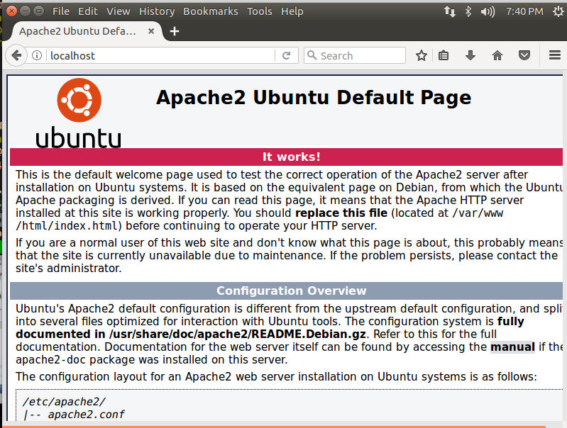

docker容器是在指定的镜像上运行的, 创建docker镜像的方法也有很多中比如直接到`docker Hub`上通过`docker pull`创建一个镜像, 也可以通过修改其它镜像然后提交修改`docker commit` 来创建新的镜像, 还有如导入某个现有的镜像, 但是在实际中难觅要定制化改进出符合特定场景的镜像, 虽然用上述方式也是可以创建新的镜像的, 但是缺点也很多, 主要缺点是不便于维护, 其实创建docker 镜像还有一种最好的办法就是手工打造`Dockerfile`, 然后通过`docker build`编译生成新的镜像, 下面本文就来实践怎么编写符合规范的Dockerfile, 然后又是怎么样通过Dockerfile来创建合适的镜像的。

<!--more-->

** 需求 ** 
需求是完成一个`Dockerfile`, 通过该`Dockerfile`创建一个Web应用, 该web应用为apache托管的一个静态页面网站, 换句话说, 我们写一个`Dockerfile`, 用来创建一个实验楼公司的网站应用, 就是 http://www.simplecloud.cn 这个站点。这个站点是纯静态的页面, 我们也可以直接下载得到。
从实现这个需求中去实践和学习关于`Dockerfile`如下三方面的内容,
- 了解Dockerfile 基本框架
- 学习Dockerfile 编写常用命令
- 通过Dockerfile 构建镜像

## Dockerfile基本框架

一份Dockerfile一般包含下面几个部分,

- `基础镜像`：以哪个镜像作为基础进行制作，用法是`FROM 基础镜像名称`
- `维护者信息`：需要写下该Dockerfile编写人的姓名或邮箱，用法是`MANITAINER 名字/邮箱`
- `镜像操作命令`：对基础镜像要进行的改造命令，比如安装新的软件，进行哪些特殊配置等，常见的是`RUN`命令
- `容器启动命令`：当基于该镜像的容器启动时需要执行哪些命令，常见的是`CMD`命令或`ENTRYPOINT`

下面创建一份Dockerfile 输入如下内容,
```bash
# Version 0.1

# 基础镜像
FROM nbuntu:latest

# 维护者信息
MAINTAINER lihong/leehongitrd@163.com 

# 镜像操作命令
RUN apt-get -yqq update && apt-get install -yqq apache2 && apt-get clean

# 容器启动命令
CMD ["/usr/sbin/apache2ctl", "-D", "FOREGROUND"]
```
> 因为直接FROM ubuntu:latest 创建的镜像, 然后基于这个镜像运行的容器中是没有`ifconfig, ping`等命令的， 所以为了本次试验自己就新建了一个镜像nbuntu, 这个镜像就包含了`ifconfig, ping`等命令

上面的`Dockerfile`就做了一件事，即创建一个apache的镜像,
- `FROM`指定基础镜像，如果镜像名称中没有制定`TAG`, 默认为`latest`。
- `RUN`命令默认使用/bin/sh Shell执行，默认为root权限。如果命令过长需要换行，需要在行末尾加`\\`。
- `CMD` 命令也是默认在/bin/sh Shell中执行，并且默认只能有一条，如果是多条CMD命令则只有最后一条执行。用户也可以在docker run命令创建容器时指定新的CMD命令来覆盖Dockerfile里的CMD。

用`docker build`将上述`Dockerfile`构建名为`test:0.1`的新镜像,
```bash 
lihong@dev:~/docker$ docker build -t test:0.1 .
Sending build context to Docker daemon 2.048 kB
Step 1 : FROM nbuntu:latest
 ---> f16a2621960a
Step 2 : MAINTAINER lihong/leehongitrd@163.com
 ---> Running in 668004fe61bd
 ---> cb74681dcdc9
Removing intermediate container 668004fe61bd
Step 3 : RUN apt -yqq update && apt install -yqq apache2 && apt clean
 ---> Running in 00968a59fa09

The following additional packages will be installed:
  apache2-bin apache2-data apache2-utils file ifupdown iproute2
  isc-dhcp-client isc-dhcp-common libapr1 libaprutil1 libaprutil1-dbd-sqlite3
  libaprutil1-ldap libasn1-8-heimdal libatm1 libdns-export162 libexpat1
  libgdbm3 libgssapi3-heimdal libhcrypto4-heimdal libheimbase1-heimdal
  libheimntlm0-heimdal libhx509-5-heimdal libicu55 libisc-export160
  libkrb5-26-heimdal libldap-2.4-2 liblua5.1-0 libmagic1 libmnl0 libperl5.22
  libroken18-heimdal libsasl2-2 libsasl2-modules libsasl2-modules-db
  libsqlite3-0 libssl1.0.0 libwind0-heimdal libxml2 libxtables11 mime-support
  netbase openssl perl perl-modules-5.22 rename sgml-base ssl-cert xml-core
Suggested packages:
  www-browser apache2-doc apache2-suexec-pristine | apache2-suexec-custom ufw
  ppp rdnssd iproute2-doc resolvconf avahi-autoipd isc-dhcp-client-ddns
  apparmor libsasl2-modules-otp libsasl2-modules-ldap libsasl2-modules-sql
  libsasl2-modules-gssapi-mit | libsasl2-modules-gssapi-heimdal
  ca-certificates perl-doc libterm-readline-gnu-perl
  | libterm-readline-perl-perl make sgml-base-doc openssl-blacklist debhelper
The following NEW packages will be installed:
  apache2 apache2-bin apache2-data apache2-utils file ifupdown iproute2
  isc-dhcp-client isc-dhcp-common libapr1 libaprutil1 libaprutil1-dbd-sqlite3
  libaprutil1-ldap libasn1-8-heimdal libatm1 libdns-export162 libexpat1
  libgdbm3 libgssapi3-heimdal libhcrypto4-heimdal libheimbase1-heimdal
  libheimntlm0-heimdal libhx509-5-heimdal libicu55 libisc-export160
  libkrb5-26-heimdal libldap-2.4-2 liblua5.1-0 libmagic1 libmnl0 libperl5.22
  libroken18-heimdal libsasl2-2 libsasl2-modules libsasl2-modules-db
  libsqlite3-0 libssl1.0.0 libwind0-heimdal libxml2 libxtables11 mime-support
  netbase openssl perl perl-modules-5.22 rename sgml-base ssl-cert xml-core
debconf: delaying package configuration, since apt-utils is not installed
0 upgraded, 49 newly installed, 0 to remove and 0 not upgraded.
Need to get 21.4 MB of archives.
After this operation, 98.3 MB of additional disk space will be used.
Step 4 : CMD /usr/sbin/apache2ctl -D FOREGROUND
 ---> Running in f954154994b2
 ---> 4abe06cc549a
Removing intermediate container f954154994b2
Successfully built 4abe06cc549a
```
查看新创建的镜像test:0.1, 
```bash 
lihong@dev:~/docker$ docker images
REPOSITORY          TAG                 IMAGE ID            CREATED             SIZE
test                0.1                 4abe06cc549a        24 seconds ago      274.1 MB
nbuntu              latest              f16a2621960a        4 hours ago         174.2 MB
redis               latest              e4a35914679d        7 days ago          182.9 MB
ubuntu              latest              0ef2e08ed3fa        8 days ago          130 MB
```
使用该镜像创建容器web1, 将容器中的端口80映射到本地80端口,
```bash
lihong@dev:~/docker$ docker run -d -p 80:80 --name web1 test:0.1
27479a43f119d213509c9af6cdfcd43330f55ed0c4fbeb08fbc3dd434744f36e
```
通过firefox浏览器打开localhost进行测试，apache已运行,
<center></center>

## 编写Dockerfile常用命令
如果构建镜像需求变更, 则只需将其增加到Dockerfile中即可。

** 1 指定容器运行的用户 **

 在一些需要指定用户来运行的应用部署时非常关键，比如提供hadoop服务的容器通常会使用hadoop用户来启动服务。该用户将作为后续的RUN命令执行的用户; 例如使用mike用户来执行后续命令, 将下面的命令添加Dockerfile中， 放置到要执行的命令之前即可，
```bash 
USER mike
```

** 2 指定后续命令的执行目录 **

假如后继需要运行的是一个静态网站，将启动后的工作目录切换到/var/www/html目录, 则, 
```bash 
WORKDIR /var/www/html
```

** 3 对外连接端口号 **
由于内部服务会启动Web服务，我们需要把对应的80端口暴露出来，可以提供给容器间互联使用，可以使用`EXPOSE`命令。
在镜像操作部分增加下面一句,
```bash
EXPOSE 80
```

** 4 设置容器主机名 **

`ENV`命令能够对容器内的环境变量进行设置, 使用该命令设置由该镜像创建的容器的主机名为dev, 向Dockerfile中增加下面一句,
```bash 
ENV HOSTNAME dev
```

** 5 向镜像中增加文件 **

向镜像中添加文件有两种命令:`COPY` 和`ADD`。

`COPY`命令可以复制本地文件夹到镜像中,
```bash
COPY website /var/www/html
```

`ADD`命令支持添加本地的`tar压缩包`到容器中指定目录, 压缩包会被自动解压为目录, 也可以自动下载URL并拷贝到镜像, 例如,
```bash
ADD html.tar /var/www
ADD http://www.shiyanlou.com/html.tar /var/www
```
根据需求, 需要的一个网站放到镜像里, 需要把一个tar包添加到apache的/var/www目录下, 因此选择使用`ADD`命令,
```bash
ADD html.tar /var/www
```

** 6 CMD与ENTRYPOINT **

`ENTRYPOINT`容器启动后执行的命令, 让容器执行表现的像一个可执行程序一样, 与`CMD`的区别是不可以被`docker run`覆盖，会把`docker run`后面的参数当作传递给`ENTRYPOINT`指令的参数。`Dockerfile`中只能指定一个`ENTRYPOINT`, 如果指定了很多, 只有最后一个有效。`docker run命令`的`-entrypoint`参数可以把指定的参数继续传递给`ENTRYPOINT`。

** 7 挂载数据卷 **

将`apache`访问的日志数据存储到宿主机可以访问的数据卷中, 
```bash 
VOLUME ["/var/log/apache2"]
```

** 8 设置容器内的环境变量 **

如在本需求中使用`ENV`设置一些`apache`启动的环境变量,
```bash
ENV APACHE_RUN_USER www-data
ENV APACHE_RUN_GROUP www-data
ENV APACHE_LOG_DIR /var/log/apche2
ENV APACHE_PID_FILE /var/run/apache2.pid
ENV APACHE_RUN_DIR /var/run/apache2
ENV APACHE_LOCK_DIR /var/lock/apche2
```

** 9 使用 Supervisord **

`CMD`只有一个命令, 当需要运行多个服务怎么办呢？最好的办法是分别在不同的容器中运行，通过`--link`进行连接，比如先前实验中用到的web, app, db容器。如果一定要在一个容器中运行多个服务可以考虑用`Supervisord`来进行进程管理，方式就是将多个启动命令放入到一个启动脚本中。

首先安装`Supervisord`, 添加下面内容到`Dockerfile`,
```bash
RUN apt-get install -yqq supervisor
RUN mkdir -p /var/log/supervisor
```

拷贝配置文件到指定的目录,
```bash
COPY supervisord.conf /etc/supervisor/conf.d/supervisord.conf
```
其中`supervisord.conf`文件需要放在/home/lihong/docker文件夹下，文件内容如下,
```bash
[supervisord]
nodaemon=true

[program:apache2]
command=/bin/bash -c "source /etc/apache2/envvars && exec /usr/sbin/apache2ctl -D FOREGROUND"
```
如果有多个服务需要启动可以在文件后继续添加`[program:xxx]`, 比如如果有ssh服务，可以增加`[program:ssh]`。

修改`CMD`命令，启动`Supervisord`,
```bash
CMD ["/usr/bin/supervisord"]
```

## 通过Dockerfile 创建镜像

将上述内容完成后放入到`/home/lihong/docker/Dockerfile`文件中，最终得到的`Dockerfile`文件如下,
```bash
# Version 0.2

# 基础镜像
FROM nbuntu:latest

# 维护者信息
MAINTAINER lihong/leehongitrd@163.com 

# 镜像操作命令
RUN apt -yqq update && apt install -yqq apache2 && apt clean
RUN apt install -yqq supervisor
RUN mkdir -p /var/log/supervisor

VOLUME ["/var/log/apche2"]

ADD html.tar /var/www
COPY supervisord.conf /etc/supervisor/conf.d/supervisord.conf

WORKDIR /var/www/html

ENV HOSTNAME dev 
ENV APACHE_RUN_USER www-data
ENV APACHE_RUN_GROUP www-data
ENV APACHE_LOG_DIR /var/log/apche2
ENV APACHE_PID_FILE /var/run/apache2.pid
ENV APACHE_RUN_DIR /var/run/apache2
ENV APACHE_LOCK_DIR /var/lock/apche2

EXPOSE 80

# 容器启动命令
CMD ["/usr/bin/supervisord"]
```

同时在/home/lihong/docker目录下，添加`supervisord.conf`文件,
```bash
[supervisord]
nodaemon=true

[program:apache2]
command=/bin/bash -c "source /etc/apache2/envvars && exec /usr/sbin/apache2ctl -D FOREGROUND"
```
并下载静态页面文件压缩包,
```bash
cd /home/lihong/docker
wget http://labfile.oss.aliyuncs.com/courses/498/html.tar
```
将http://simplecloud.cn 网站的页面tar包下载下来， 放到和Dockerfile文件同一个文件夹中。 然后通过`docker build`创建镜像, `-t`参数指定镜像名称,
```bash
lihong@dev:~/docker$ docker build -t test:0.2 .
Sending build context to Docker daemon 7.708 MB
Step 1 : FROM nbuntu:latest
 ---> f16a2621960a
Step 2 : MAINTAINER lihong/leehongitrd@163.com
 ---> Using cache
 ---> cb74681dcdc9
Step 3 : RUN apt -yqq update && apt install -yqq apache2 && apt clean
 ---> Using cache
 ---> a7b7dce4c67c
Step 4 : RUN apt install -yqq supervisor
 ---> Running in 3b86e3c6eec0
...
```

通过`docker images`查看到新镜像`test:02`已经创建好了,
```bash 
hong@dev:~/docker$ docker images
REPOSITORY          TAG                 IMAGE ID            CREATED              SIZE
test                0.2                 0886fdb745c8        About a minute ago   308.9 MB
test                0.1                 4abe06cc549a        50 minutes ago       274.1 MB
``` 

下面用新镜像`test:02`创建新的容器web, 并映射本地的80端口到容器的80端口,
```bash
lihong@dev:~/docker$ docker run -d -p 80:80 --name web test:0.2
0221f5e699201a0f2d6757289970752ec696fa8fcb25b91bff7134d78af20a7e
```
在firefox输入本地地址访问127.0.0.1，看到我们克隆的琛石科技的网站,
<center></center>

## 总结

- 通过实际案例了解Dockerfile编写的基本框架
- 简要回顾Dockerfile 编写常用命令
- 通过Dockerfile 构建镜像, 并测试成功

