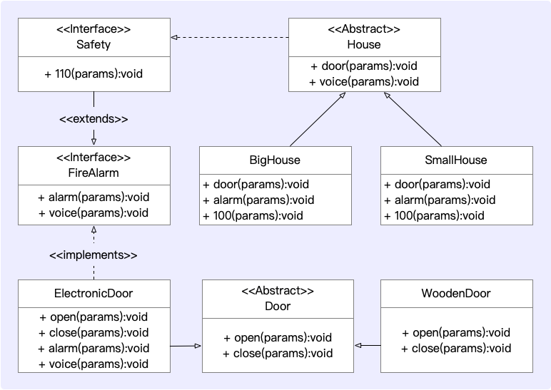

接口和抽象类的区别是什么？什么时候用接口？什么时候用抽象类？抽象类和接口存在的意义是什么？能解决哪些编程问题？
<!--more-->

## 语法特性

抽象类: 不允许被实例化，只能被继承。它可以包含属性和方法。方法既可以包含代码实现，也可以不包含代码实现。不包含代码实现的方法叫作抽象方法。子类继承抽象类，必须实现抽象类中的所有抽象方法。

接口: 不能包含属性，只能声明方法，方法不能包含代码实现。包含抽象方法、静态方法、default 方法；类实现接口时，必须实现抽象方法。

## 解决哪些编程问题

抽象类: 是对成员变量和方法的抽象，是一种 is-a 关系，是为了解决代码复用问题。

接口: 仅仅是对方法的抽象，是一种 has-a 关系，表示具有某一组行为特性，是为了解决解耦问题，隔离接口和具体的实现，提高代码的扩展性。

## 应用场景

什么时候该用抽象类？什么时候该用接口？

如果要表示一种 is-a 的关系，并且是为了解决代码复用问题，就用抽象类；

如果要表示一种 has-a 关系，并且是为了解决抽象而非代码复用问题，那就用接口。

解决复用问题：java中的子类FileInputStream和PipeInputStream等继承抽象类InputStream。重写了read(source)方法，InputStream 中还包含其他方法，FileInputStream继承抽象类复用了父类的其他方法。

解决抽象问题：抽象类InputStream实现了Closeable接口，该接口中包含close()抽象方法。Closeable这个接口还在很多其他类中实现了，例如Channel，Socket中都有close() 关闭这个功能，但具体实现每个类又各有不同的实现，这个就是抽象。

## 联系

- 抽象类可以实现接口，而且可以只实现部分接口。

> 接口A有三个方法: aa(),bb(),cc()，抽象类B只实现了接口A的aa(),bb()两个方法，而剩下的cc()方法怎么办呢？
> 这时，当一个类C继承B时，就需要实现cc()方法了。这样的结果是:C类可以使用A接口的所有方法，而且可以自定义cc()方法的逻辑。
> 而如果C直接实现接口A，那么它必须实现A的所有方法。当C有aa(),bb()方法逻辑相同的兄弟类时，直接实现接口A的思路就会造成代码的重复率比较高了。

- 接口可以继承接口，但是接口不能继承抽象类。

## 参考

- [选择接口还是抽象类](https://www.it610.com/article/2291299.htm)
