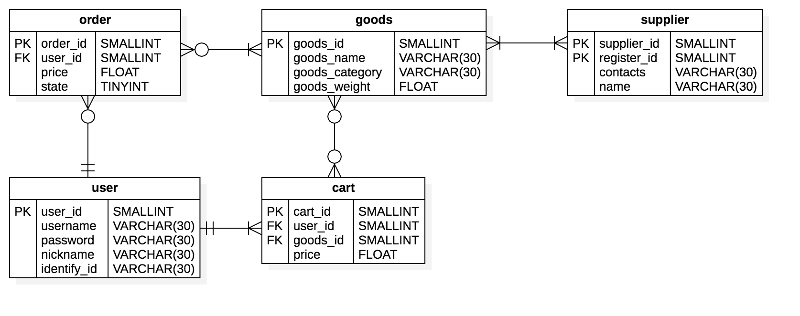

设计出符合业务需求的数据存储模型至关重要, 合理的数据库表设计不仅能有效的应对业务数据的存储, 还能高效的对已存储的数据进行访问操作; 本文将以数据库设计范式等知识背景来进一步探讨数据库逻辑设计相关问题;
<!--more-->

## 数据库设计

优良设计的参考基准

- 减少数据冗余;
- 避免数据维护异常;
- 节省存储空间;
- 高效的访问;

数据库设计过程主要经过以下几个阶段, 

```shell
需求分析--> 逻辑设计--> 物理设计-->维护优化
```

### 需求分析阶段

分析数据库需求的作用点,

- 数据是什么;
- 数据由哪些属性;
- 数据和属性各自的特点;
- 了解数据的生命周期;
- 非核心数据的归档和清理策略定制;
- 了解实体与实体之间的关系(1:1, 1:N, M:N);
- 哪些属性或属性的组合可以唯一标识一个实体;

### 逻辑设计阶段

- 将需求转化为数据库的逻辑模型;
- 通过ER图的形式对逻辑模型进行展示;
- 逻辑设计与所选用的具体DBMS系统无关;


### 物理设计阶段

- 根据数据库自身的特点把逻辑设计转换为物理设计; 

### 维护优化阶段

- 新的需求进行建表;
- 索引优化;
- 大表拆分;

## 实例分析

> 以一个小型电商为例, 电商网站包含如下几个核心模块: 用户模块, 商品模块, 订单模块, 购物车模块, 供用商模块;

### 用户模块

|||
|:---|:---|
|`功能`| 用于记录注册用户信息|
|`包括属性`| 用户名, 密码, 电话, 邮箱, 身份证号, 地址, 姓名, 昵称 ...|
|`可选唯一标识属性`| 用户名, 身份证, 电话|
|`存储特点`| 随系统上线时间逐渐增加, 需要永久存储, 考虑分库分表问题|

### 商品模块

|||
|:---|:---|
|`功能`| 用于记录网站中所销售的商品信息|
|`包括属性`| 商品编码, 商品名称, 商品描述, 商品品类, 供应商名称, 重量, 有效期, 价格 ...|
|`可选唯一标识属性`| (商品名称, 供应商名称), (商品编码) |
|`存储特点`| 对于下线商品可以归档存储|

### 订单模块

|||
|:---|:---|
|`功能`| 用于用户订购商品的信息|
|`包括属性`| 订单号, 用户姓名, 用户电话, 收货地址, 商品编号, 商品名称, 数量, 价格, 订单状态, 支付状态, 订单类型 ...|
|`可选唯一标识属性`| (订单号)|
|`存储特点`| 永久存储(分表, 分库存储)|

### 购物车模块 

|||
|:---|:---|
|`功能`| 用于保存用户购物时选购的商品|
|`包括属性`| 用户名, 商品编号, 商品名称, 商品价格, 商品描述, 商品分类, 加入时间, 商品数量 ...|
|`可选唯一标识属性`| (用户名, 商品编号, 加入时间), (购物车编号) |
|`存储特点`| 不用永久存储( 设置归档, 清理规则)|

### 供应商模块 

|||
|:---|:---|
|`功能`| 用于保存所销售商品的供应商信息 |
|`包括属性`| 供应商编号, 供应商名称, 联系人, 电话, 营业执照号, 地址, 法人 ...|
|`可选唯一标识属性`| (供应商编号), (营业执照号)|
|`存储特点`| 永久存储 |

### 模块间关系图

```shell

   订单 <---(多对多)---> 商品 < ---(多对多)---> 供应商
    ^                     ^
    |                     |
 (1对多)               (多对多)
    |                     |
    v                     v
   用户 <---(1对多)----> 购物车
```

> 需求分析需要理清楚实体属性字段及存储特点;
> 需求分析需要理清楚实体间的关系; 

## 逻辑设计ER图

### 知识回顾

|||
|:---|:---|
|`关系`|一个关系对应通常所说的一张表|
|`元组`|表中的一行即为一个元组|
|`属性`|表中的一列即为一个属性; 每个属性都有一个名称, 称为属性名|
|`候选码`|表中的某个属性组, 它可以唯一确定一个元组|
|`主码`|一个关系有多个候选码, 选定其中一个为主码|
|`域`|属性的取值范围|
|`分量`|元组中的一个属性值|

ER图例说明

|||
|:---|:---|
|`矩形`|表示实体集, 矩形内写实体集的名字|
|`菱形`|表示联系集|
|`椭圆`|表示实体的属性|
|`线段`|将属性连接到实体集, 或将实体集连接到联系集|

### ER图分析

下面是将前面的电商网站实例分析部分用ER图展示, 



- 图中仅表示出order(订单), goods(商品), supplier(供应商), user(用户), 购物车(cart) 五个实体, 同时也只大致列出了实体中的一些属性字段值,(因仅做分析学习没有详细列出实体的属性, 实体属性页应根据业务实际情况进行详细分析最终确定, 故而也没有通用的实体属性集);
- 图中清晰刻画了实体间的关系

|实体集|关系|说明|
|:---|:---|:---|
|`user与order`     | `1 对 0...many`       | 用户可以拥有0个或多个订单, 而一个订单只能且必须属于某一个人|
|`user与cart`      | `1 对 1...many`       | 用户至少拥有一个购物车, 一个购物车只能属于某一个用户|
|`order与goods`    | `0...many 对 1...many`| 一个订单至少有一个商品, 而商品可以不属于也可以属于多个订单|
|`goods与cart`     | `0...many 对 0...many`|一个商品可以属于0个或多个购物车中, 一个购物车也可以放置0个或多个商品|
|`goods与supplier` | `1...many 对1...many` |一个商品至少有一个供用商, 而供应商至少应提供一个商品(否则的话就不能算供应商了)|


## 逻辑设计规范

通过上述ER图分析, 可以帮助用户理清各个实体的属性数据和其特征及实体之间的关系, 那如何将这些实体属性设计成数据表呢? 是通过一张表表示还是要通过多张表来设计? 哪些应该设计在一张表中, 哪些实体属性字段又应该设计在分开的数据表中呢?  为尽量合理设置数据表, 就需要进一步了解数据库表的设计规范, 

数据库设计范式的主要作用是是的符合设计范式的数据库表在存储操作过程可以做到简洁高效,减少冗余数据, 同时最大限度的避免一些插入更新删除的异常情况发生; 

常见的数据库设计范式, 

- 第一范式
- 第二范式
- 第三范式
- 第四范式(不常见)
- 第五范式(不常见)
- BC范式

数据操作异常 

|||
|:---|:---|
|`插入异常`|如果某实体A随着另一个实体B的存在而存在, 即缺少某个实体B时无法表示这个实体A, 那么这个表就存在插入异常|
|`更新异常`|如果更改表所对应的某个实体实例的单独属性时, 需要将多行更新, 那么就说这个表存在更新异常|
|`删除异常`|如果删除表的某一行来反映某实体实例, 失效时导致另一个不同实体实例信息丢失, 那么这个表中就存在删除异常|

数据冗余是指相同的数据在多个地方存在, 或者说表中的某个列可以由其它列计算得到, 这样就说表中存在着数据冗余;

## 第一范式(1NF)

### 知识回顾

**第一范式: 数据库表中的所有字段都是单一属性, 不可再分的;**

单一属性是由基本的数据类型所构成的, 如整数, 浮点数, 字符串等;

也就是说 第一范式 要求数据库中的表都是二维表( 即由行和列组成的表)

### 实例分析

下面两张表都符合第一范式,

表一

|用户ID|用户名|密码|姓名|电话|
|:---|:---|:---|:---|:---|
|1|zhang3|\***|张三|010100200|

表二

|用户ID|用户名|密码|用户信息|
|:---|:---|:---|:---|:---|
||||**姓名**|**电话**|
|1|zhang3|\***|张三|010100200|

在现在大多数数据库中设计的表都是符合第一范式要求的， 但是都不会去设计出上述第二张表那样的结构;

## 第二范式(2NF)

### 知识回顾

**第二范式: 数据库的表中不存在非关键字段对任一候选关键字段的部分函数依赖;**

部分函数依赖是指存在着组合关键字中的某一关键字决定非关键字的情况

换句话说: 所有单关键字段的表都符合第二范式 

### 实例分析
表

|商品名称|供应商名称|价格|描述|重量|供应商电话|有效期|分类|
|:---|:---|:---|:---|:---|:---|:---|:---|
|可乐|饮料一厂|2.00||250ml|88888|2018.1|饮料|
|可乐|饮料二厂|2.00||250ml|66666|2018.1|饮料|

显然商品和供应商之间是多对多的关系; 

所以上表中只有使用商品名称+供应商名称才可以唯一标识出一件商品;

也就是说商品名称和供应商名称是一组组合关键字, 所以上表中字段如下, 

|组合关键字| 候选关键字段|非关键字段|
|:---|:---|:---|
|商品名称+供应商名称|商品名称|价格|
||供应商名称|描述|
|||重量|
|||供应商电话|
|||有效期|
|||分类|

上表中存在如下的部分函数依赖关系,

```shell
如通过商品名称找到其价格,描述,重量等信息;
(商品名称) --> (价格, 描述, 重量, 商品有效期)

通过供应商名称找到其联系信息等;
(供应商名称) --> (供应商电话)
```

即上表中存在 非关键字段对候选关键字的部分函数依赖关系, 所以不符合第二范式要求的, 那这种不符合第二范式要求的表可能会存在哪些问题呢? 

1. 插入异常
如果饮料一厂没有提供饮料, 则在上表中就找不到饮料一厂的相关信息, 只有插入了饮料一厂提供的饮料才能找到饮料一厂的相关信息, 这种就称之为插入异常;

2. 删除异常
如果把上表中所有饮料一厂提供的饮料信息删除, 那在上表中就找不到饮料一厂的相关信息了;

3. 更新异常
假如饮料一厂提供了很多种饮料如可乐, 雪碧等, 此时要更新饮料一厂的供用商电话, 那所有饮料一厂的数据行都要更新; 一般只要存在插入异常或删除异常就存在更新异常;

4. 数据冗余
上表中可以看到供应商信息会随着饮料品种的增多而大量冗余;

可以通过将上表进行信息拆分来来解决上述问题, 

可以将商品信息及供应商信息拆分成两张表, 此外为建立商品与供应商关系 还应在新建一张关系表, 

goods 

|商品ID|商品名称|价格|描述|重量|有效期|分类|
|:---|:---|:---|:---|:---|:---|:---|
|1|可乐|2.00||250ml|2018.1|饮料|

supplier

|供应商ID|供应商名称|供应商电话| 
|:---|:---|:---|
|1|饮料一厂|88888|
|2|饮料二厂|66666|

r_supplier_goods

|供应商ID|商品ID|
|:---|:---|
|1|1|

拆分成三张表后, 每张表都是单关键字表了，符合第二范式要求;

## 第三范式(3NF)

### 知识回顾

**第三范式: 在第二范式的基础之上定义的, 如果数据表中不存在非关键字对任意候选关键字段的传递函数依赖则符合第三范式;**

### 实例分析

表

|商品名称|价格|商品描述|重量|有效期|分类|分类描述|
|:---|:---|:---|:---|:---|:---|:---|
|可乐|3.00||250ml|2020.10|酒水饮料|碳酸饮料|
|苹果|8.00||500g||生鲜食品|水果|

存在以下传递函数依赖关系,

```shell
(商品名称)-->(分类)-->(分类描述)
```

也就是说存在非关键字段"分类描述"对关键字段"商品名称"的传递函数依赖;

所以上述表不符合第三范式要求, 那么不存在第三范式要求的表可能会存在什么问题呢? 

显然, (分类,分类描述) 对于每一个商品都会进行记录, 所以存在着数据冗余, 同时也还存在数据的插入, 更新及删除异常;

可以通过对信息拆分成多张表来解决上述问题;

goods 

|商品名称|价格|商品描述|重量|有效期|
|:---|:---|:---|:---|:---|
|可乐|3.00||250ml|2020.10|
|苹果|8.00||500g||

category 

|分类|分类描述|
|:---|:---|
|酒水饮料|碳酸饮料|
|生鲜食品|水果|

r_goods_category

|分类ID|商品ID|
|:---|:---|
|1|1|

拆分后三张表就不存在传递函数依赖了， 符合第三范式要求;

## BC范式(BCNF)

### 知识回顾

**BC范式: 在第三范式的基础之上, 数据库表中如果不存在任何字段对任一候选键字段的传递函数依赖则符合BC范式;**

也就是说如果是复合关键字, 则复合关键字之间也不能存在函数依赖关系;

### 实例分析

表

|供应商|商品ID|供应商联系人|商品数量|
|:---|:---|:---|:---|
|饮料一厂|1|张三|10|
|饮料一厂|2|李四|20|
|饮料二厂|1|王五|10|


假设: 供应商联系人只能受雇于一家供应商,每家供应商可以供应多个商品, 则存在如下决定关系, 

```shell
(供应商, 商品ID) --> (联系人, 商品数量)

(联系人, 商品ID) --> (供应商, 商品数量)
```

存在下列关系因此不符合BCNF要求, 

```shell
(供应商） --> (供应商联系人)
(供应商联系人) --> (供应商)
```

并且存在数据操作异常及数据冗余

如果饮料二厂还没有提供任何饮料，则此时就看不到饮料二厂的相关信息;  (插入异常)
删除饮料二厂提供的所有商品, 饮料二厂信息丢失 (删除异常)
更新饮料二厂信息, 所有饮料二厂饮料信息需要更新 (更新异常)
饮料二厂提供多种饮料 饮料二厂信息数据冗余 


通过拆分成两张表来解决上述问题, 

goods_supplier

|供应商|商品ID|商品数量|
|:---|:---|:---|
|饮料一厂|1|10|
|饮料一厂|2|20|
|饮料二厂|1|30|

supplier

|供应商|供应商联系人|
|:---|:---|
|饮料一厂|张三|
|饮料一厂|李四|
|饮料二厂|王五|

可以看到拆分后的两张表就满足了BC范式的要求了;

## 总结

- 数据库表设计大致经历需求分析,逻辑ER图设计, 物理设计, 维护优化等几个阶段;
- 通过一个电商网站实例分析了数据库需求分析过程;
- 回顾了ER图知识, 实例分析ER图回顾逻辑设计阶段的相关知识点;
- 逻辑设计有第一二三四五范式及BC范式;
- 回顾第一二三及BC范式相关知识,通过实例分析;
- 第一范式要求数据库表设计符合二维表;
- 第二范式要求数据库表中不存在非关键字的对任一候选关键字段的部分函数依赖;
- 第三范式要求在第二范式基础上不存在非关键字段对任一候选关键字的传递函数依赖;
- BC范式则要求在第三范式基础上不存在任一字段对任一候选关键字段的传递函数依赖;
