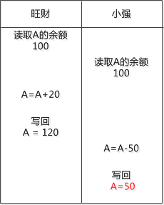
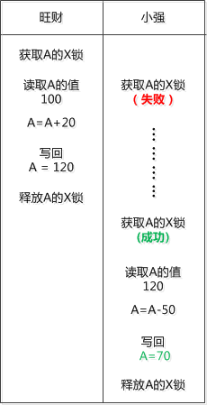
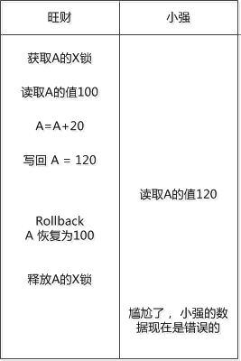
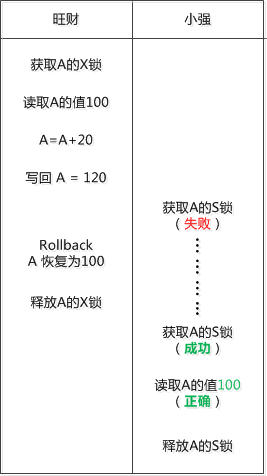
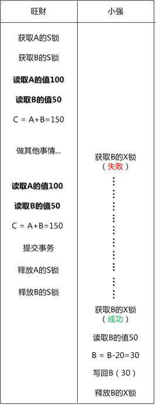

事务指的是满足`ACID`特性的一组操作, mysql中可以通过commit提交一个事务,也可以使用rollback进行回滚。 在并发场景中很难保证事务的`Isolation`特性, 即无法保证临界资源的排它性操作, 从而引发数据一致性问题, 临界资源互斥问题显然需要借助加锁来解决, 在并发事务中就需要用锁的并发控制来处理; 
<!--more-->
根据在事务处理中对临界资源加锁及释放锁的阶段不同,可分为三种加锁方式, 即mysql的三级封锁协议, 三级封锁协议可分别解决数据丢失, 脏读, 不可重复读问题,即mysql事务隔离级别的读未提交, 读已提交, 可重读; 

此外还有第四种隔离级别, 即事务串行化, 即把并行转换为串行, 也就无所谓加锁不加锁了; 下文将通过实际案例分析精要回顾事务及事务隔离级别等相关知识; 

>  实际情况下, 在读已提交及可重读读两中隔离级别下, Mysql/Oracle/PgSQL等是利用MVCC来处理事务，防止加锁，来提高访问效率;

## 事务命令

### 查看当前隔离级别

```sql
dev@testdb>show variables like '%iso%';
+-----------------------+-----------------+
| Variable_name         | Value           |
+-----------------------+-----------------+
| transaction_isolation | REPEATABLE-READ |
+-----------------------+-----------------+

dev@testdb>select @@transaction_isolation;
+-------------------------+
| @@transaction_isolation |
+-------------------------+
| REPEATABLE-READ         |
+-------------------------+
1 row in set (0.00 sec)
```

### 设置事务隔离级别

```sql
dev@testdb>set transaction isolation level repeatable read;
dev@testdb>set transaction_isolation='read-uncommitted';
dev@testdb>set transaction_isolation='read-committed';
dev@testdb>set transaction_isolation='serializable';
dev@testdb>set transaction_isolation='repeatable-read';
```

### 查看系统锁情况

```sql
dev@testdb>show status like 'innodb_row_lock%';
+-------------------------------+-------+
| Variable_name                 | Value |
+-------------------------------+-------+
| Innodb_row_lock_current_waits | 0     |
| Innodb_row_lock_time          | 0     |
| Innodb_row_lock_time_avg      | 0     |
| Innodb_row_lock_time_max      | 0     |
| Innodb_row_lock_waits         | 0     |
+-------------------------------+-------+
5 rows in set (0.04 sec)
```

- 查看当前系统锁的情况, 当系统锁争用比较严重的时候, `Innodb_row_lock_waits`和`Innodb_row_lock_time_avg`的值会比较高;

### 事务提交及回滚

```sql
/*
commit, rollback用来确保数据库有足够的剩余空间;
commit,rollback只能用于DML操作, 即insert、update、delet;
rollback操作撤销上一个commit、rollback之后的事务。
*/
 
create table test
(
 PROD_ID varchar(10) not null,
 PROD_DESC varchar(25)  null,
 COST decimal(6,2)  null
);
 
/*禁止自动提交*/
set autocommit=0;
 
/*设置事务特性,必须在所有事务开始前设置*/
set transaction read only;  /*设置事务只读*/
set transaction read write;  /*设置事务可读、写*/
 
/*开始一次事务*/
start transaction;
insert into test values('4456','mr right',46.97);
commit;     /*位置1*/
 
insert into test values('3345','mr wrong',54.90);
rollback;    /*回到位置1,(位置2);上次commit处*/
 
insert into test values('1111','mr wan',89.76);
rollback;    /*回到位置2,上次rollback处*/
 
/*测试保存点savepoint*/
savepoint point1;
update test
set PROD_ID=1;
rollback to point1;  /*回到保存点point1*/
 
release savepoint point1; /*删除保存点*/
 
drop table test;
```

## ACID

### **原子性(Atomicity)**
原子性是指事务包含的所有操作要么全部成功,要么全部失败回滚。失败回滚的操作事务,将不能对事务有任何影响。

### **一致性(Consistency)**
一致性是指事务必须使数据库从一个一致性状态变换到另一个一致性状态,也就是说一个事务执行之前和执行之后都必须处于一致性状态。
例如: A和B进行转账操作,A有200块钱,B有300块钱;当A转了100块钱给B之后,他们2个人的总额还是500块钱,不会改变。

### **隔离性(Isolation)**
隔离性是指当多个用户并发访问数据库时,比如同时访问一张表,数据库每一个用户开启的事务,不能被其他事务所做的操作干扰(也就是事务之间的隔离),<font color=red>多个并发事务之间,应当相互隔离</font>。
例如:同时有T1和T2两个并发事务,从T1角度来看,T2要不在T1执行之前就已经结束,要么在T1执行完成后才开始。将多个事务隔离开,每个事务都不能访问到其他事务操作过程中的状态;就好比上锁操作,只有一个事务做完了,另外一个事务才能执行。

### **持久性(Durability)**
持久性是指事务的操作,一旦提交,对于数据库中数据的改变是永久性的,即使数据库发生故障也不能丢失已提交事务所完成的改变。

## 隔离级别

### **未提交读(READ UNCOMMITTED)**
不存在事务隔离级别的时, 会造成数据丢失问题, 

很明显的看出,旺财对A添加的20块不翼而飞了,这就是"数据丢失",对事务不加任何锁(不存在事务隔离),就会导致这种问题。

未提交读事务隔离级别,
未提交事务隔离级别满足<font color=red>一级封锁协议, 即写数据的时候添加一个X锁(排他锁),也就是在写数据的时候不允许其他事务进行写操作,但是读不受限制,读不加锁</font>。

这样就可以解决了多个人一起写数据而导致了"数据丢失"的问题,但是会引发新的问题——脏读。

<font color=red>脏读:读取了别人未提交的数据</font>。

因而引入了另外一个事务隔离级别——读已提交,

### **读已提交(READ COMMITTED)**

读已提交满足<font color=red>二级封锁协议, 即写数据的时候加上X锁(排他锁),读数据的时候添加S锁(共享锁),且如果一个数据加了X锁就没法加S锁;同理如果加了S锁就没法加X锁,但是一个数据可以同时存在多个S锁(因为只是读数据),并且规定S锁读取数据,一旦读取完成就立刻释放S锁(不管后续是否还有很多其他的操作,只要是读取了S锁的数据后,就立刻释放S锁)。</font>

这样就解决了脏读的问题,但是又有新的问题出现——不可重复读。

不可重复读:同一个事务对数据的多次读取的结果不一致。

解决方法——引入隔离级别更高事务隔离:可重复读

### **可重复读(REPEATABLE READ)**
可重复读满足<font color=red>第三级封锁协议, 即对S锁进行修改,之前的S锁是:读取了数据之后就立刻释放S锁,现在修改是:在读取数据的时候加上S锁,但是要直到事务准备提交了才释放该S锁,X锁还是一致。</font>

这样就解决了不可重复读的问题了,但是又有新的问题出现——幻读。

例如: 有一次旺财对一个"学生表"进行操作,选取了年龄是18岁的所有行, 用X锁锁住, 并且做了修改。

改完以后旺财再次选择所有年龄是18岁的行, 想做一个确认, 没想到有一行竟然没有修改！

原来就在旺财查询并修改的的时候, 小强也对学生表进行操作, 他插入了一个新的行,其中的年龄也是18岁！ 虽然两个人的修改都没有问题, 互不影响, 但最终结果并非预期, 即幻读问题;

解决幻读的方式——串行化

### **可串行化(SERIALIZABLE)**
事务只能一件一件的进行,不能并发进行。

### 结论

|隔离级别|数据丢失|脏读|不可重复读|幻读|
|:---|:---|:---|:---|:---|
|读未提交|NO|YES|YES|YES|
|读已提交|NO|NO|YES|YES|
|可重复读|NO|NO|NO|YES|
|事务串行化执行|NO|NO|NO|NO|

> mysql默认的隔离级别是:可重复读。

> oracle中只支持2个隔离级别:读已提交和串行化, 默认是读已提交。

> 隔离级别的设置只对当前链接有效;

## 锁粒度

mysql支持表锁及行锁, InnoDB存储引擎可支持三种行锁定方式, <font color=red>默认加锁方式是next-key 锁</font>。
1. 行锁(Record Lock):锁直接加在索引记录上面，锁住的是key。 行锁又分为共享锁(S)与排他锁(X);
2. 间隙锁(Gap Lock):锁定索引记录间隙，确保索引记录的间隙不变。间隙锁是针对事务隔离级别为可重复读或以上级别而已的。
3. Next-Key Lock: 行锁和间隙锁组合起来就叫Next-Key Lock。 

默认情况下，InnoDB工作在可重复读(Repeatable Read)隔离级别下，并且会以Next-Key Lock的方式对数据行进行加锁，这样可以有效防止幻读的发生。Next-Key Lock是行锁和间隙锁的组合，当InnoDB扫描索引记录的时候，会首先对索引记录加上行锁（Record Lock），再对索引记录两边的间隙加上间隙锁（Gap Lock）。加上间隙锁之后，其他事务就不能在这个间隙修改或者插入记录。

## 间隙锁

### 概念
间隙锁指对某个记录行范围进行锁定, 如锁定第一行到第三行, 即锁定(1,3) 那第一行至第三行中间就不能进行写入操作, 同时第一行至第三行数据不能进行update/delete等任何修改操作;

### 作用

间隙锁的目的是为了防止幻读，其主要通过两个方面实现这个目:
1. 防止间隙内有新数据被插入;
2. 防止已存在的数据, 更新成间隙内的数据;

间隙锁在InnoDB的唯一作用就是防止其它事务的插入操作，以此来达到防止幻读的发生，所以间隙锁不分什么共享锁与排它锁。 默认情况下，InnoDB工作在Repeatable Read隔离级别下，并且以Next-Key Lock的方式对数据行进行加锁，这样可以有效防止幻读的发生。Next-Key Lock是行锁与间隙锁的组合，当对数据进行条件，范围检索时，对其范围内也许并存在的值进行加锁！当查询的索引含有唯一属性（唯一索引，主键索引）时，Innodb存储引擎会对next-key lock进行优化，将其降为record lock,即仅锁住索引本身，而不是范围！若是普通辅助索引，则会使用传统的next-key lock进行范围锁定！

要禁止间隙锁的话，可以把隔离级别降为Read Committed，或者开启参数innodb_locks_unsafe_for_binlog。
 
## RR级别+MVCC+GL 解决幻读问题
在MVCC并发控制中，读操作可以分成两类:快照读 (snapshot read)与当前读 (current read)。
1. 快照读，读取的是记录的可见版本 (有可能是历史版本)，不用加锁。
2. 当前读，读取的是记录的最新版本，并且，当前读返回的记录，都会加上锁，保证其他事务不会再并发修改这条记录。 

在一个支持MVCC并发控制的系统中，哪些读操作是快照读？哪些操作又是当前读呢？以MySQL InnoDB为例: 

快照读:简单的select操作，属于快照读，不加锁。

```sql
select * from table where ?; 
```

当前读:特殊的读操作，插入/更新/删除操作，属于当前读，需要加锁。

```sql
select * from table where ? lock in share mode;
select * from table where ? for update;
insert into table values (…);
update table set ? where ?;
delete from table where ?;
```

所有以上的语句，都属于当前读，读取记录的最新版本。并且，读取之后，还需要保证其他并发事务不能修改当前记录，对读取记录加锁。其中，除了第一条语句，对读取记录加S锁 (共享锁)外，其他的操作，都加的是X锁 (排它锁)。 

回顾4种隔离级别: 
Read Uncommited
可以读取未提交记录。此隔离级别，不会使用，忽略。

Read Committed (RC)
快照读忽略，本文不考虑。

针对当前读，RC隔离级别保证对读取到的记录加锁 (record lock)，存在幻读现象。

Repeatable Read (RR)
快照读忽略，本文不考虑。

针对当前读，RR隔离级别保证对读取到的记录加锁 (记录锁)，同时保证对读取的范围加锁，新的满足查询条件的记录不能够插入 (间隙锁)，不存在幻读现象。

Serializable
从MVCC并发控制退化为基于锁的并发控制。不区别快照读与当前读，所有的读操作均为当前读，读加读锁 (S锁)，写加写锁 (X锁)。

Serializable隔离级别下，读写冲突，因此并发度急剧下降，在MySQL/InnoDB下不建议使用。
对于快照读来说，幻读的解决是依赖mvcc解决。而对于当前读则依赖于gap-lock解决。

此外, 对于快照读来说，幻读的解决是依赖mvcc解决。而对于当前读则依赖于gap-lock解决。

## 总结
- 回顾了事务相关操作命令;
- 回顾了事务的ACID特性及四级隔离级别, 三级封锁协议相关知识;
- 回顾锁粒度(表锁/行锁(S/X锁)), 及行锁的三种方式(RL,GL, NKL);
- 进一步回顾了Gap Lock相关知识;
- 回顾了Next Key Lock + MVCC 在RR隔离级别下解决幻读原理;
