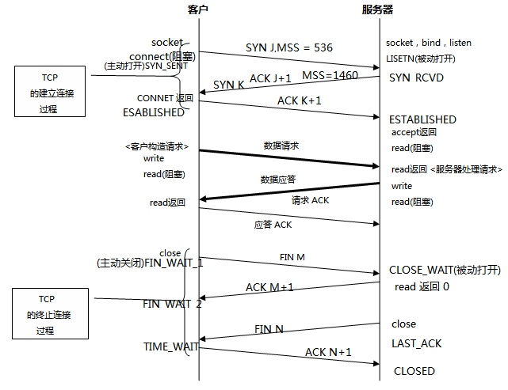

学习`TCP`连接需要三次握手四次挥手过程后, 进一步分析学习`TCP`连接通信过程及过程状态信息, 将有助于排除和定位网络或系统故障;
<!--more-->

##### TCP通信完整过程

`TCP`通信完整过程

`TCP`通信过程状态信息

##### TCP通信过程状态

深入理解`TCP`通信过程, 对排除和定位网络或系统故障时大有帮助, 但是怎样牢牢地将这张图刻在脑中呢？ 那么你就一定要对这张图的每一个状态, 及转换的过程有深刻的认识, 不能只停留在一知半解之中。下面对这张图的11种状态详细解析一下, 

||状态|说明|
|:---|:---|:---|
|1|`CLOSED`| 表示初始状态。|
|2|`LISTEN`|  表示服务器端的某个 `SOCKET` 处于监听状态, 可以接收连接了。|
|3|`SYN_RCVD`| 这个状态表示接收到了 SYN 报文, 在正常情况下, 这个状态是服务器端的`SOCKET` 在建立 `TCP` 连接时的三次握手会话过程中的一个中间状态, 很短暂, 基本上用 netstat 你是很难看到这种状态的, 除非你特意写了一个客户端测试程序, 故意将三次 `TCP` 握手过程中最后一个 `ACK` 报文不予发送。因此这种状态时, 当收到客户端的 `ACK` 报文后, 它会进入到 ESTABLISHED 状态。|
|4|`SYN_SENT`| 这个状态与 `SYN_RCVD` 相呼应, 当客户端 `SOCKET` 执行 `CONNECT` 连接时, 它首先发送`SYN`报文, 因此也随即它会进入到了 `SYN_SENT` 状态, 并等待服务端的发送三次握手中的第 2 个报文。`SYN_SENT` 状态表示客户端已发送`SYN`报文。|
|5|`ESTABLISHED`| 表示连接已经建立了。|
|6|`FIN_WAIT_1`| `FIN_WAIT_1` 和 `FIN_WAIT_2` 状态的真正含义都是表示等待对方的 FIN 报文。而这两种状态的区别是: `FIN_WAIT_1` 状态实际上是当 `SOCKET` 在 `ESTABLISHED` 状态时, 它想主动关闭连接, 向对方发送了 FIN 报文, 此时该 `SOCKET` 即进入到 `FIN_WAIT_1` 状态。而当对方回应 `ACK` 报文后, 则进入到 `FIN_WAIT_2` 状态, 当然在实际的正常情况下, 无论对方何种情况下, 都应该马 上回应 `ACK` 报文, 所以 `FIN_WAIT_1` 状态一般是比较难见到的, 而 `FIN_WAIT_2` 状态还有时常常可以用 netstat 看到。|
|7|`FIN_WAIT_2`|`FIN_WAIT_2` 状态下的 `SOCKET`, 表示半连接, 也即有一方要求`close`连接, 但另外还告诉对方, 我暂时还有点数据需要传送给你, 稍后再关闭连接。|
|8|`TIME_WAIT`| 表示收到了对方的`FIN`报文, 并发送出了 `ACK` 报文, 就等`2MSL`后即可回到`CLOSED`可用状态了。如果 `FIN_WAIT_1` 状态下, 收到了对方同时带`FIN`标志和`ACK` 标志的报文时, 可以直接进入到`TIME_WAIT`状态, 而无须经过 `FIN_WAIT_2` 状态。|
|9|`CLOSING`|(图中没有标志这种状态) 这种状态比较特殊, 实际情况中应该是很少见, 属于一种比较罕见的例外状态。正常情况下, 当你发送 `FIN` 报文后, 按理来说是应该先收到（或同时收到）对方的 `ACK` 报文, 再收到对方的 `FIN` 报文。但是 CLOSING 状态表示你发送 `FIN` 报文后, 并没有收到对方的 `ACK` 报文, 反而却也收到了对方的 `FIN` 报文。什么情况下会出现此种情况呢？其实细想一下, 也不难得出结论: 那就是如果双方几乎在同时`close`一个 `SOCKET` 的话, 那么就出现了双方同时发送 `FIN` 报文的情况, 也即会出现`CLOSING`状态, 表示双方都正在关闭 `SOCKET` 连接。|
|10|`CLOSE_WAIT`| 这种状态的含义其实是表示在等待关闭。怎么理解呢？当对方 `close` 一个 `SOCKET` 后发送 FIN 报文给自己, 系统毫无疑问地会回应一个 `ACK` 报文给对方, 此时则进入到 `CLOSE_WAIT` 状态。接下来若没有数据要发送给对方, 就可以 `close` 这个 `SOCKET`, 发送`FIN`报文给对方, 也即关闭连接。所以你在 `CLOSE_WAIT` 状态下, 需要完成的事情是等待你去关闭连接。|
|11|`LAST_ACK`| 它是被动关闭一方在发送 FIN 报文后, 最后等待对方的 `ACK` 报文。当收到 `ACK` 报文后, 也即可以进入到`CLOSED`可用状态了。|

Reference
* * *
[1] [TCP 通信过程中各步骤的状态](https://blog.csdn.net/tennysonsky/article/details/45646561)
