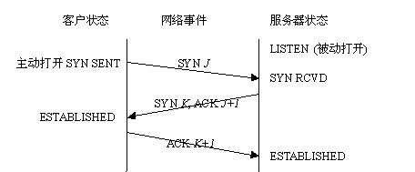
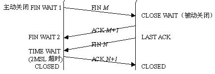

理解`TCP`连接三次握手和四次挥手过程对深入学习应用`TCP`网络编程十分重要, 相关网络资源也灰常丰富,  本文对`TCP`建立和关闭连接中的三次握手和四次挥手过程进行完整分析, 同时参考网络学习资源归纳总结成文;
<!--more-->

##### 三次握手
* * * 
在`TCP/IP`协议中, `TCP`协议提供可靠的连接服务, 采用三次握手建立一个连接。

**第一次握手:** 建立连接时, 客户端发送`SYN`包(syn=j)到服务器, 并进入 `SYN_SEND` 状态, 等待服务器确认;  

**第二次握手:** 服务器收到`SYN`包, 必须确认客户的 `SYN`（ack=j+1）, 同时自己也发送一个 `SYN` 包（syn=k）, 即 `SYN`+`ACK` 包, 此时服务器进入 SYN_RECV 状态;  

**第三次握手:** 客户端收到服务器的 `SYN`＋`ACK` 包, 向服务器发送确认包 `ACK`(ack=k+1), 此包发送完毕, 客户端和服务器进入 `ESTABLISHED` 状态, 完成三次握手。
 

通过这样的三次握手, 客户端与服务端建立起可靠的`双工`的连接, 开始传送数据。 三次握手的最主要目的是保证连接是`双工`的, 可靠更多的是通过重传机制来保证的。

** 但是为什么一定要进行三次握手来保证连接是`双工`的呢, 一次握手不行么？两次不行么？**

前两次握手是为了保证服务端能收接受到客户端的信息并能做出正确的应答, 为了保证客户端能够接收到服务端的信息并能做出正确的应答而进行后两次(第二次和第三次)握手。 

##### 四次挥手
* * *
由于 `TCP` 连接是`全双工`的, 因此每个方向都必须单独进行关闭。那`TCP` 的四次握手, 是为了保证通信双方都关闭了连接, 具体过程如下: 

1）客户端发送一个 `FIN`, 用来关闭客户端到服务器的数据传送; 
2）服务器收到这个 `FIN`, 它发回一个 `ACK`, 确认序号为收到的序号加 1。和 `SYN` 一样, 一个`FIN`将占用一个序号; 
3）服务器关闭与客户端的连接, 发送一个`FIN`给客户端; 
4）客户端发回 `ACK` 报文确认, 并将确认序号设置为收到序号加1。

**为什么建立连接协议是三次握手, 而关闭连接却是四次握手呢？**

这是因为服务端的 `LISTEN` 状态下的 `SOCKET` 当收到 `SYN` 报文的建连请求后, 它可以把 `ACK` 和 `SYN`（`ACK` 起应答作用, 而 `SYN` 起同步作用）放在一个报文里来发送。但关闭连接时, 当收到对方的 `FIN` 报文通知时, 它仅仅表示对方没有数据发送给你了, 但是你还可以给对方发送数据, 也有这么种可能, 你还有一些数据在传给对方的途中, 所以你不能立马关闭连接,也即你可能还需要把在传输途中的数据给对方之后, 又或者, 你还有一些数据需要传输给对方后, （再关闭连接）再发送`FIN` 报文给对方来表示你同意现在可以关闭连接了, 所以它这里的 `ACK` 报文和 `FIN` 报文多数情况下都是分开发送的。

**为什么 `TIME_WAIT` 状态还需要等`2MSL`(Wait For Double Maximum Segment Life(MSL) Time) 后才能返回到 `CLOSED` 状态？**

这是因为虽然双方都同意关闭连接了, 而且握手的`4`个报文也都协调和发送完毕, 按理可以直接回到 `CLOSED` 状态（就好比从 `SYN_SEND` 状态到`ESTABLISH`状态那样）; 但是因为我们必须要假想网络是不可靠的, 你无法保证你最后发送的 `ACK` 报文会一定被对方收到, 因此对方处于 `LAST_ACK` 状态下的 `SOCKET` 可能会因为超时未收到 `ACK` 报文, 而重发 `FIN` 报文, 所以这个`TIME_WAIT`状态的作用就是用来重发可能丢失的 `ACK` 报文。

Reference 

* * * 
[1] [Linux网络编程——浅谈 TCP 三次握手和四次挥手](https://blog.csdn.net/tennysonsky/article/details/45622395)
[2] [关于FIN_WAIT2](https://huoding.com/2016/09/05/542)
